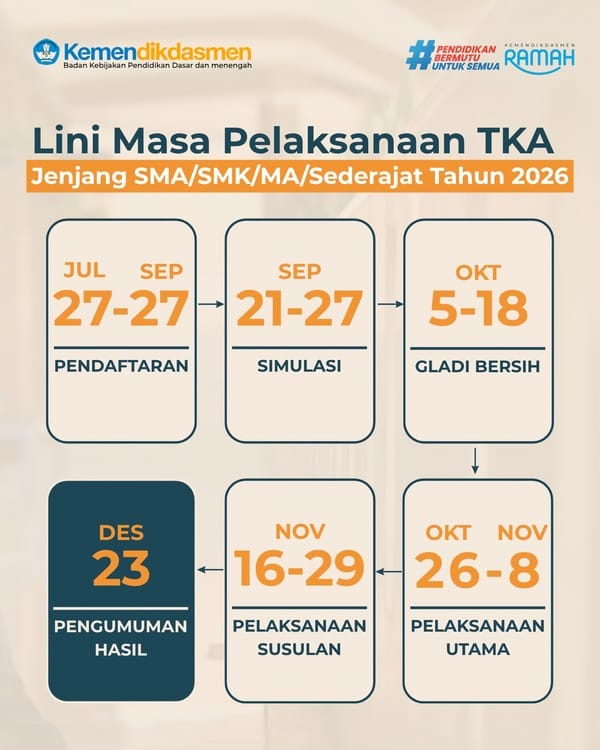
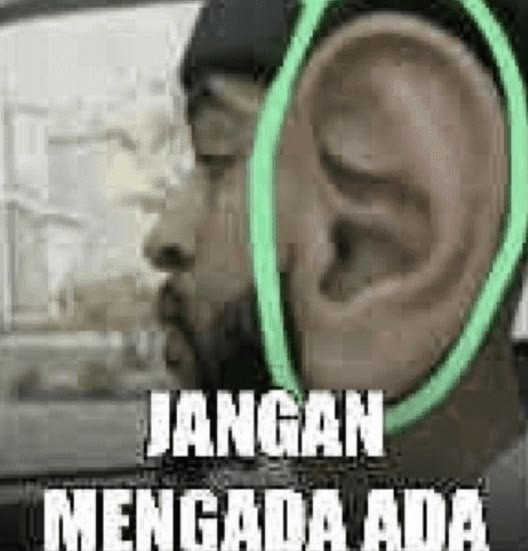

## Sebelum ke roadmap belajar, Lihat dulu jadwal TKA biar tenang

---

## Sedikit Motivasi

jadikan belajar beberapa materi ini sebagai alasan supaya jadi pengetahuan yang berguna untuk masa depan kamu sendiri.  
belajar sesuatu sebagai investment jangka panjang, bukan beban kewajiban, lakukan sebisanya aja.

Hitung-hitung nambah skill yang sebelumnya belum pernah ada.

Tidak semua orang butuh semua rumpun ilmu ini dengan urgency yang sama.

kebutuhan lebih penting dari perfection.  
Prioritas sesuai kebutuhan kamu aja.

---

## KOLEKSI MATERI MANDIRI TKA SMK (7,5 MINGGU 24 Oktober)

**Mata Pelajaran Wajib:** Bahasa Indonesia | Matematika | Bahasa Inggris

**Mata Pelajaran Pilihan:** PKWU | Kejuruan PPLG (Pengembangan Perangkat Lunak dan Gim)

---

### FASE 1: Fondasi & Logika Dasar (Minggu 1–2)

> **Fokus Utama:** Memperkuat konsep dasar matematika aljabar, kebahasaan standar, serta pemahaman logika dasar pemrograman dan bisnis.

1. **Matematika — Aljabar & Eksponen**
* **Sub-Materi:** Operasi eksponen, bentuk akar, logaritma, persamaan & pertidaksamaan linear.
* **Target Output:** Mampu menyederhanakan persamaan aljabar kompleks dan menentukan nilai variabel.

2. **Bahasa Indonesia — Literasi Bacaan & PUEBI**
* **Sub-Materi:** Ide pokok, gagasan utama, kalimat utama vs penjelas, ejaan standar (EYD V).
* **Target Output:** Menemukan inti paragraf secara cepat dan mengidentifikasi kesalahan tanda baca/kata baku.

3. **Bahasa Inggris — Grammar Dasar & Vocab**
* **Sub-Materi:** *Tenses* (*Present, Past, Future*), *Pronouns*, *Parts of Speech*, konteks makna kata.
* **Target Output:** Melengkapi kalimat rumpang dan menentukan makna kata teknis sesuai konteks.

4. **PKWU — Konsep Kewirausahaan**
* **Sub-Materi:** Karakteristik wirausaha, analisis SWOT, identifikasi peluang dan risiko usaha.
* **Target Output:** Menganalisis kelebihan/kelemahan produk berdasarkan kasus studi bisnis sederhana.

5. **Kejuruan PPLG — Algoritma & Dasprog**
* **Sub-Materi:** *Flowchart*, *pseudocode*, tipe data, variabel, kontrol alur (*If-Else, Switch-Case*), *Looping* (*For, While*).
* **Target Output:** *Tracing* logika program dan menentukan *output* dari baris kode dasar.

---

### FASE 2: Penerapan Konseptual (Minggu 3–4)

> **Fokus Utama:** Menerapkan rumus dan logika ke dalam bentuk soal cerita, struktur data dasar, dan tata bahasa fungsional.

1. **Matematika — Aritmatika & Deret**
* **Sub-Materi:** Aritmatika sosial (persentase, untung/rugi, bunga), Barisan & Deret Aritmatika/Geometri.
* **Target Output:** Menyelesaikan soal cerita simulasi keuangan dan perhitungan pola berulang.

2. **Bahasa Indonesia — Teks Informasi & Laporan**
* **Sub-Materi:** Teks Laporan Hasil Observasi (LHO), Teks Eksplanasi, pemisahan fakta vs opini.
* **Target Output:** Menganalisis keabsahan data dalam teks dan menyimpulkan hubungan sebab-akibat peristiwa.

3. **Bahasa Inggris — Functional Grammar**
* **Sub-Materi:** *Passive Voice*, *Conditional Sentences* (Type 1, 2, 3), *Modals*, *Direct/Indirect Speech*.
* **Target Output:** Mengubah bentuk kalimat aktif-pasif dan menginterpretasikan pengandaian situasi.

4. **PKWU — Perhitungan Finansial Usaha**
* **Sub-Materi:** Biaya Tetap (*FC*), Biaya Variabel (*VC*), Harga Pokok Penjualan (HPP), *Break Even Point* (BEP).
* **Target Output:** Menghitung titik impas usaha dan menentukan harga jual produk yang ideal.

5. **Kejuruan PPLG — OOP & Database Dasar**
* **Sub-Materi:** Pilar OOP (*Class, Object, Encapsulation, Inheritance*), ERD, Relasi Tabel, SQL DDL (*CREATE, ALTER*).
* **Target Output:** Merancang struktur tabel basis data dan menentukan pilar OOP pada *snippet* kode.

---

### FASE 3: Pemodelan & Analisis (Minggu 4-5)

> **Fokus Utama:** Menganalisis data, menarik inferensi dari teks kompleks, serta mengeksekusi query database lanjutan.

1. **Matematika — Matriks & Statistika**
* **Sub-Materi:** Operasi matriks, determinan, invers, Ukuran Pemusatan Data (Mean, Median, Modus), Peluang.
* **Target Output:** Mengolah data statistik dari diagram dan menentukan peluang suatu kejadian.

2. **Bahasa Indonesia — Teks Argumentatif & Opini**
* **Sub-Materi:** Teks Editorial, Teks Kritis/Artikel, menyunting kalimat tidak efektif.
* **Target Output:** Menentukan keberpihakan penulis dan mengoreksi struktur kalimat ambigu.

3. **Bahasa Inggris — Reading Comprehension**
* **Sub-Materi:** *Main idea*, *implicit information*, *inference*, *business letter/email*, *procedure text*.
* **Target Output:** Mengambil kesimpulan tersirat dari teks panjang dan dokumen dunia kerja.

4. **PKWU — Pemasaran & Hak Cipta**
* **Sub-Materi:** *Marketing Mix* (4P/7P), Strategi Pemasaran Digital, HKI (Hak Kekayaan Intelektual/Paten).
* **Target Output:** Menentukan media promosi yang tepat dan memahami legalitas hak cipta produk.

5. **Kejuruan PPLG — SQL Query & Web/Gim**
* **Sub-Materi:** SQL DML (*SELECT, JOIN, GROUP BY*), Arsitektur Web (Client-Server, REST API), Logic Game Loop.
* **Target Output:** Menulis query manipulasi data antartabel dan memahami alur pertukaran data sistem web/gim.

---

## FASE 4: Integrasi & HOTS (Minggu 5-7)

> **Fokus Utama:** Menyelesaikan soal pemecahan masalah tingkat tinggi (HOTS), pengujian kode/system debugging, serta evaluasi sintesis.

1. **Matematika — Kalkulus Dasar & Model HOTS**
* **Sub-Materi:** Limit fungsi, Turunan (aplikasi nilai maksimum/minimum), Integral dasar.
* **Target Output:** Menyelesaikan *optimization problem* (mencari luas atau keuntungan maksimum) berbentuk soal cerita.

2. **Bahasa Indonesia — Evaluasi & Sintesis Teks**
* **Sub-Materi:** Membandingkan 2 teks berbeda, mengevaluasi akurasi argumen, sintesis paragraf baru.
* **Target Output:** Menilai simpulan yang paling valid dari gabungan dua sumber bacaan.

3. **Bahasa Inggris — Error Analysis & Advanced**
* **Sub-Materi:** *Error recognition*, analisis struktur kalimat kompleks, pemahaman teks teknis (*technical reading*).
* **Target Output:** Menemukan bagian tata bahasa yang salah pada teks teknis atau dokumen spesifikasi.

4. **PKWU — Evaluasi Laporan Keuangan**
* **Sub-Materi:** Laporan Laba-Rugi sederhana, Neraca, analisis rasio keuntungan usaha.
* **Target Output:** Membaca kondisi kesehatan finansial perusahaan berdasarkan laporan keuangan.

5. **Kejuruan PPLG — SDLC & Pemodelan Sistem**
* **Sub-Materi:** Metode SDLC (*Agile, Waterfall*), UML (*Use Case Diagram, Activity Diagram*), *Code Debugging*.
* **Target Output:** Menganalisis diagram UML sistem perangkat lunak dan melacak *bug* logika atau sintaks.

---

## 📌 Kesimpulan: RINCIAN MATERI PER MATA PELAJARAN

### 1. Matematika (Wajib)
* **Eksponen & Akar:** Sifat-sifat pangkat, merasionalkan bentuk akar, logaritma dasar.
* **Aljabar & SPLDV/SPLTV:** Sistem persamaan linear 2/3 variabel, pertidaksamaan linear.
* **Aritmatika Sosial & Deret:** Bunga tunggal/majemuk, diskon, barisan & deret aritmatika/geometri.
* **Matriks:** Penjumlahan, perkalian matriks, determinan matriks 2x2 dan 3x3, invers matriks.
* **Statistika & Peluang:** Mean, median, modus data kelompok, simpangan baku, permutasi, kombinasi, peluang kejadian.
* **Kalkulus Dasar:** Turunan fungsi aljabar, aplikasi turunan (nilai maksimum/minimum), integral tak tentu & tentu.

### 2. Bahasa Indonesia (Wajib)
* **Literasi Bacaan:** Ide pokok, kalimat utama, fakta vs opini, inferensi teks.
* **Ejaan & Tata Bahasa (EYD V):** Penggunaan huruf kapital, tanda baca (koma, titik dua, titik koma), kata baku.
* **Analisis Teks:** Teks Laporan Hasil Observasi (LHO), Eksplanasi, Prosedur, Editorial, dan Negosiasi.
* **Menyunting Kalimat:** Mengidentifikasi dan memperbaiki kalimat efektif, pemborosan kata, dan ambigu.

### 3. Bahasa Inggris (Wajib)
* **Grammar & Structure:** Simple Present, Past, Future, Present Perfect, Passive Voice, Conditional Sentence (Type 1-3).
* **Reading Comprehension:** Main idea, topic sentence, implied information, synonym/antonym in context.
* **Functional & Technical Texts:** Business emails, job application letters, manual instructions, technical reading.
* **Error Recognition:** Mengidentifikasi kesalahan tata bahasa dalam kalimat/paragraf.

### 4. PKWU (Prakarya dan Kewirausahaan - Pilihan)
* **Konsep Dasar:** Analisis SWOT, karakteristik wirausaha, analisis peluang usaha.
* **Perhitungan Finansial:** Biaya Tetap (FC), Biaya Variabel (VC), HPP (Harga Pokok Penjualan), BEP unit & rupiah.
* **Pemasaran:** Marketing Mix 4P (Product, Price, Place, Promotion), strategi digital marketing.
* **Legalitas & Keuangan:** Hak Kekayaan Intelektual (HKI/Paten), laporan laba-rugi sederhana.

### 5. Kejuruan PPLG (Pilihan)
* **Pemrograman Dasar:** Flowchart, pseudocode, tipe data, variabel, operator, branching (*if-else*, *switch*), looping (*for*, *while*).
* **Object-Oriented Programming (OOP):** Class, Object, Encapsulation, Inheritance, Polymorphism, Abstraction.
* **Database / Basis Data:** ERD (Entity Relationship Diagram), Relasi Tabel, SQL DDL (*CREATE*, *ALTER*), SQL DML (*SELECT*, *INSERT*, *UPDATE*, *DELETE*, *JOIN*, *GROUP BY*).
* **Pengembangan Web & Gim:** Arsitektur Client-Server, REST API dasar, Game Loop, Collision Detection dasar.
* **Rekayasa Perangkat Lunak:** SDLC (Waterfall, Agile/Scrum), UML (Use Case Diagram, Class Diagram, Activity Diagram), Debugging code.

---

## 😴 PANDUAN EKSEKUSI HARIAN

* **Pola Rotasi Harian:** Pelajari 2 mata pelajaran setiap hari (1 Wajib + 1 Pilihan) dengan durasi 60–90 menit per mata pelajaran.
* **Pembagian Porsi Belajar:**
* **40% Konsep Teori:** Pahami logika aturan atau rumus dasar.
* **60% Praktik Soal:** Langsung kerjakan soal latihan berbasis kasus atau *code tracing*.

---

<iframe width="100%" height="300" scrolling="no" frameborder="no" allow="autoplay; encrypted-media" src="https://w.soundcloud.com/player/?url=https%3A//api.soundcloud.com/tracks/soundcloud%253Atracks%253A482962890&color=%2321383e&auto_play=false&hide_related=false&show_comments=true&show_user=true&show_reposts=false&show_teaser=true&visual=true"></iframe>
<a href="https://soundcloud.com/zizozero12" title="abdo" target="_blank" style="color: #cccccc; text-decoration: none;">abdo</a> · <a href="https://soundcloud.com/zizozero12/alanwalker-darkside" title="Alanwalker Darkside(originalmix).mp3" target="_blank" style="color: #cccccc; text-decoration: none;">Alanwalker Darkside</a>

